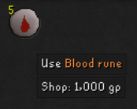

# Iron Value

Ths plugin focuses on providing Iron players with the values their items are worth to them. Instead of grand exchange or high alch values, show the highest shop value when that's realistically how you would convert this item to cash, or other items if that's often their purpose.

I.e., the High Alch price for a Blood Rune is 240 GP, but realistically, an Iron player would bulk sell these for 200 GP each to Ali, so the Iron Value of that item is 200 GP.

# Features

## Gold price tooltips

- Blood runes
- Death runes

## Commodity exchange tooltips

- Minnows to sharks
- Marks of Grace to stamina doses / amylase crystals
- Stardust to Uncut Gems

## Tokkul price tooltips

- Chaos runes
- Death runes